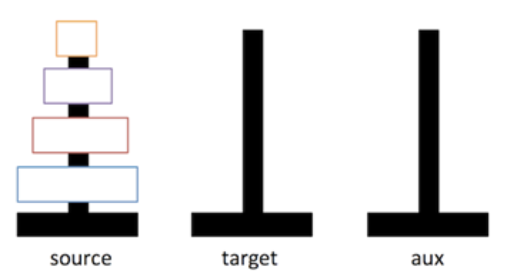
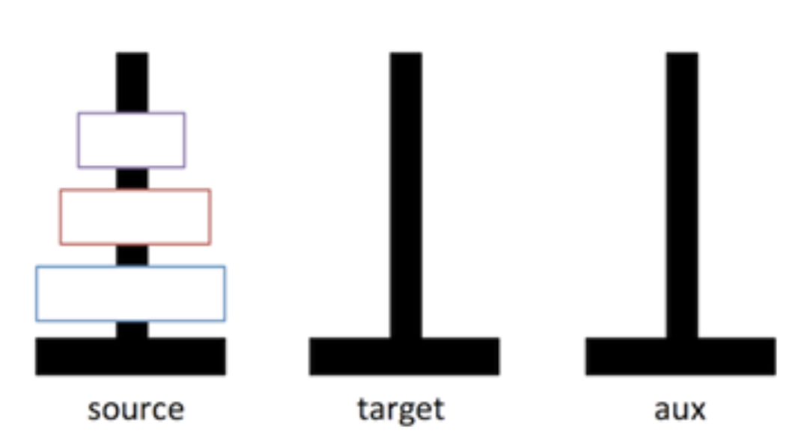
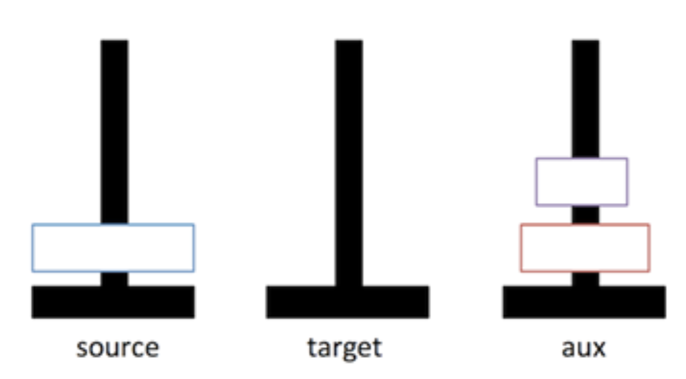
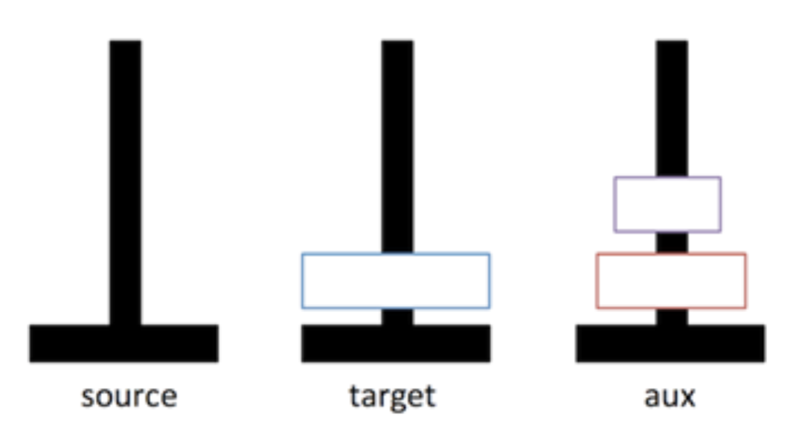

# Introduction

The Towers of Hanoi is a puzzle game that consists of three rods and a number of disks of different sizes that slide onto the rods. The game starts with all disks on one rod in an ordered fashion from bottom to top. The picture below shows the initial configuration of a Towers of Hanoi with four disks. 

The goal of the game is to move the disks from the initial rod (labeled source) to another rod (labeled target) using the auxiliary rod to help. You can only move one rod at a time and no disk may be placed on top of a smaller disk.

# Instructions

In this activity you will derive a recursive algorithm to solve the Towers of Hanoi puzzle.  Start with the configuration below for a Towers of Hanoi with only three disks. What would be a better configuration that would lead us to the final solution for this puzzle?  

For example, what if we had all the disks except the larger one on the auxiliary rod, like the picture below? 

We would be very close to the solution, don’t you agree?  How about if we consider as a sub-problem: to move the two smaller disks from source to the aux using target to help? Assuming we were able to move the two smaller disks from source to aux, the next step would be to move the larger disk from source to target. See the picture below.  

Now the final step would be to move the disks on the auxiliary rod to the target one using the source rod to help. If we do that we will be able to solve the Hanoi Towers puzzle (for size three).

Now try to write the code to solve the hanoi towers puzzle for an arbitrary number of disks. Use recursion to reduce the size of the problem and get closer to the solution. Think about what would be the base-case for the recursion. 

To represent the rods use an array or *Rod* objects. This class has methods like push, to add disks on top of the rod, and pop to retrieve disks added from the top. 

